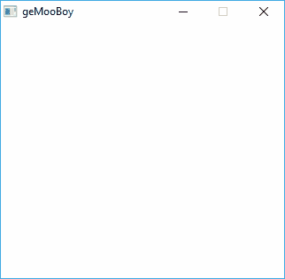

# 🐮geMooBoi

geMooBoi is a GameBoy emulator written in Go.

## 💾Installation

### Requirements
* Go 1.10 and up
* [Ebiten](https://github.com/hajimehoshi/ebiten)

```
$ go get github.com/hajimehoshi/ebiten
```

## ⚙️Build

```
$ git clone https://github.com/MartiGJ/geMooBoi.git
$ cd MartiGJ/geMooBoi
$ go build
```

## 📝To Do
* Joypad inputs
* Sound
* Interrupts

## 📷Images


## 🎓License
[MIT](https://choosealicense.com/licenses/mit/)
