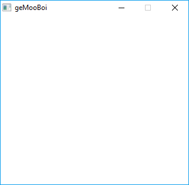

# 🐮geMooBoi

geMooBoi is a GameBoy emulator written in Go.

## 💾Installation

### Requirements

- Go 1.10 and up
- [Ebiten](https://github.com/hajimehoshi/ebiten)

```
$ go get github.com/hajimehoshi/ebiten
```

## ⚙️Building

```
$ git clone https://github.com/MartiGJ/geMooBoi.git
$ cd geMooBoi
$ go build
```

## 📝To Do

- OBJ-to-BG Priority bit for Sprites
- Sound
- Proper interrupt timing
- HALT & STOP instructions
- Proper Memory Bank Controllers

## 🖼️Example GIFs



## 🎓License

[MIT](https://choosealicense.com/licenses/mit/)
